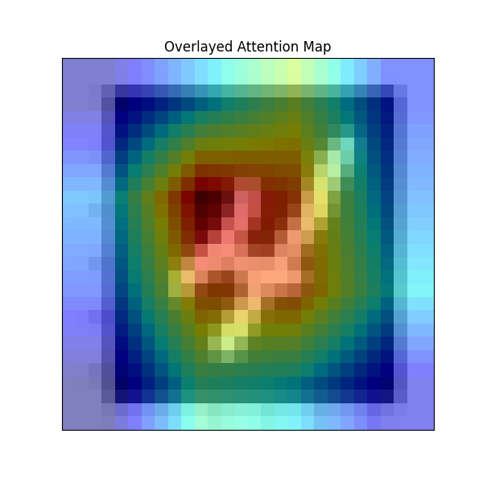

# Vision Transformer(Attention Mapの出力も含む)
## フォルダ構成
```
root/
│
├── imagenet/              # ImageNetデータセット用
│   ├── train.py           # モデルの学習スクリプト
│   ├── vis_attn.py        # 注目領域の可視化スクリプト
│   └── dataloaders/       # データローダー関連コード
│       ├── classes.py     # クラス情報の管理
│       ├── dataset.py     # データセットの定義と前処理
│       └── imagenet-1k.py # ImageNet-1k用の設定
│
├── mnist/                 # MNISTデータセット用
│   ├── train.py           # モデルの学習スクリプト
│   └── vis_attn.py        # 注目領域の可視化スクリプト
│
├── models/                # モデル定義
│   ├── attentionblock.py  # ViTのAttention Blockの定義
│   └── vit.py             # ViTモデルの定義
│
├── utils/                 # ユーティリティモジュール
│   ├── img_to_patch.py    # 画像をパッチに分割するモジュール
│   └── img2attn.py        # Attention Heatmapの抽出モジュール
│
└── README.md              # プロジェクト全体の説明ファイル
```

## 使い方
### 学習(MNIST)
1. パッケージのインストール
```
pip install torch torchvision
pip install -r requirements.txt
```
2. VisionTransformerの構造の決定
```python
model = VisionTransformer(embed_dim=768,
                          hidden_dim=768*4,
                          num_heads=8,
                          num_layers=12,
                          patch_size=16,
                          num_channels=3,
                          num_patches=196,
                          num_classes=1000,
                          dropout=0.2)
```
※hidden_dimは，3*num_headsで割り切れるようにする必要がある．
3. 訓練スクリプトの実行
```
python -m mnist.train
```

### Attention mapの可視化のためのパラメータの決定術
- $embed_dim$: アテンション埋め込み次元（推奨値: 768, 512, 1024）
- $hidden_dim$: フィードフォワード層の隠れ次元(通常4*embed_dim)
- $num_heads$: アテンションヘッド数(embed_dim % num_heads == 0)
- $num_layers$: トランスフォーマーブロックの数（一般的には6~12）
- $num_classes$: 出力クラス数
- $dropout$: ドロップアウト率(推奨値: 0.1~0.3)
- $num_channels$: 入力画像のチャンネル数(1: グレースケール, 3: RGB)
- $patch_size$: パッチの１辺のピクセル数（推奨値: 16, 32）
- $num_patches$: パッチの合計数(計算式: $(H/patch_size)×(W/patch_size)$)
### アテンション関連のチェックリスト
- $embed_dim % num_heads == 0$: head_dimが整数であるか確認
- $embed_dim % (3*num_heads) == 0$: qkv出力形状が割り切れるか確認
### Attention mapの可視化
1. `vis_attn.py`を編集
```
image_path = "<注目領域を可視化したい画像のパス>"
model_path = "<重みファイル>"
output_path = "<出力ファイルのパス>"
```
2. 可視化スクリプトの実行
```
python -m mnist.vis_attn.py
```
3. 実行確認

    

## Reference
- [An Image is Worth 16x16 Words: Transformers for Image Recognition at Scale](https://arxiv.org/abs/2010.11929)
- [ImageNet Large Scale Visual Recognition Challenge](https://arxiv.org/abs/1409.0575)